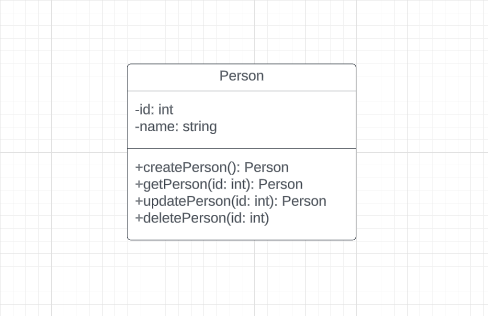

# API Documentation
This documentation oulines the endpoints for **HNGX Task2 CRUD API.**

# UML Diagram
The UML class diagram for the "Person" model provides a visual representation of the essential attributes of the 'Person' model and the operations that can be carried out on it.
###



###
## Base URL
The base URL for all endpoints is `http://localhost:8000`


## Authentication
There was no specified authentication method for this API from the task description.

## API Endpoints

### 1. Create a new Person
Create a new `Person` by passing a `name` key value pair in the request body.
- **URL: `/api/`**
- **Method: `POST`**
- **Request Body:**
```json
{
  "name": "Elon Musk"
}
```
- **Success Response**
  - **Status Code: `201 Created`**
  - **Response Body:** 
  ```json
    {
      "message": "Person Created!",
      "person": {
        "name": "Elon Musk",
        "id": 1
      }
    }
  ```
- **Error Responses**
  - **Status Code: `400 Bad Request`**
  - **Response Body:** 
  ```json
    {
      "errors": [
        {
          "type": "field",
          "msg": "The name field is required",
          "path": "name",
          "location": "body"
        },
        {
          "type": "field",
          "msg": "The name field can only take string as value.",
          "path": "name",
          "location": "body"
        },
        {
          "type": "field",
          "msg": "name must contain at least two characters",
          "path": "name",
          "location": "body"
        }
      ]
    }
  ```
  - **Status Code: `400 Bad Request`**
  - **Response Body:** 
  ```json
    {
      "message": "This person already exists" //passed a name that already exists in the db
    }
  ```
  - **Status Code: `500 Internal Server Error`**
  - **Response Body:** 
  ```json
    {
      "error": "An error occured while creating a person.",
    }
  ```

### 1. Get a Person
This endpoint retrieves a person by its `id`.
- **URL: `/api/:id`**
- **Method: `GET`**
- **URL Parameters:**
  - **`id`**_(integer)_: The unique identifier of the person.
  
- **Success Response**
  - **Status Code: `200 OK`**
  - **Response Body:** 
  ```json
    {
      "id": 1,
      "name": "Elon Musk"
    }
  ```

- **Error Responses**
  - **Status Code: `400 Bad Request`**
  - **Response Body:** 
  ```json
    {
      "errors": [
          {
            "type": "field",
            "value": "", //passed string value as id param
            "msg": "id must be an integer",
            "path": "id",
            "location": "params"
          }
      ]
    }
  ```
  - **Status Code: `404 Not Found`**
  - **Response Body:** 
  ```json
    {
      "message": "Person not found" //passed an id that is not present in the db
    }
  ```
  - **Status Code: `500 Internal Server Error`**
  - **Response Body:** 
  ```json
    {
      "error": "An error occured while retrieving person."
    }
  ```

### 1. Update a Person
This endpoint retrieves a person by its `id` and updates the person's name by passing a `name` key value pair in the request body.
- **URL: `/api/:id`**
- **Method: `PUT`**
- **URL Parameters:**
  - **`id`**_(integer)_: The unique identifier of the person.
- **Request Body:**
```json
{
  "name": "Mark Essien"
}
```
- **Success Response**
  - **Status Code: `200 OK`**
  - **Response Body:** 
  ```json
    {
      "message": "Person Updated!",
      "person": {
        "id": 1,
        "name": "Mark Essien"
      }
    }
  ```

- **Error Responses**
  - **Status Code: `400 Bad Request`**
  - **Response Body:** 
  ```json
    {
      "errors": [
        {
          "type": "field",
          "value": "",//passed string value as id param
          "msg": "id must be an integer",
          "path": "id",
          "location": "params"
        }
      ]
    }
  ```
  - **Status Code: `404 Not Found`**
  - **Response Body:** 
  ```json
    {
      "message": "Person not found" //passed an id that is not present in the db
    }
  ```
  - **Status Code: `500 Internal Server Error`**
  - **Response Body:** 
  ```json
    {
      "error": "An error occured while retrieving person."
    }
  ```


### 1. Delete a Person
This endpoint deletes a person by its `id`.
- **URL: `/api/:id`**
- **Method: `DELETE`**
- **URL Parameters:**
  - **`id`**_(integer)_: The unique identifier of the person.
- **Success Response**
  - **Status Code: `200 OK`**
  - **Response Body:** 
  ```json
    {
      "message": "Person Deleted!"
    }
  ```

- **Error Responses**
  - **Status Code: `400 Bad Request`**
  - **Response Body:** 
  ```json
    {
      "errors": [
        {
          "type": "field",
          "value": "",//passed string value as id param
          "msg": "id must be an integer",
          "path": "id",
          "location": "params"
        }
      ]
    }
  ```
  - **Status Code: `404 Not Found`**
  - **Response Body:** 
  ```json
    {
      "message": "Person not found" //passed an id that is not present in the db
    }
  ```
  - **Status Code: `500 Internal Server Error`**
  - **Response Body:** 
  ```json
    {
      "error": "An error occured while retrieving person."
    }
  ```
